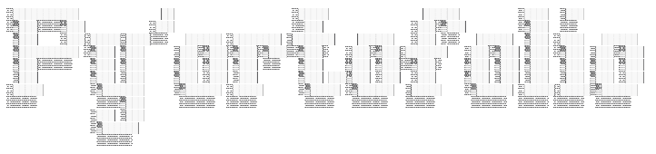

<p align="center">
  <a href="https://opencode.ai">
    <picture>
      
    </picture>
  </a>
</p>

<p align="center" style="color: #c3e3d6"><b>My personal portofolio for PBP courses.</b></p>
<p align="center">
  <a href="https://www.python.org"></a>
  <a href="https://www.djangoproject.com/"></a>
  <a href="https://sqlite.org"></a>
</p>

<pre align="left">
Nama    : Zayyan Ramadzaki Firdaus
NPM     : 2506550955
Kelas   : PBP F
</pre>

## Deskripsi Project

Website ini merupakan portofolio pribadi saya yang sedang dikembangkan guna memenuhi penilaian PBP Semester Gasal 2026/2027. Portofolio saya mengandung identitas pribadi, latar belakang pendidikan saya, sedikit trivia mengenai saya, dan kemampuan yang saya punya.

Saat ini, website yang saya kembangkan masih bersifat statis dan sederhana. Pembaharuan akan dilakukan secara berkala, *so, stay tuned!*.

**Tech stack:**


## Setup

Proyek ini membutuhkan Python 3.13 atau versi yang mendukung dependency pada [requirements.txt](requirements.txt), pastikan Python sudah ter-install, kemudian jalankan perintah berikut pada terminal direktori proyek untuk membuat *virtual environment*:

```bash
python -m venv env
```

Lalu aktifkan *virtual environment*:

> Untuk powershell
```bash
env\Scripts\Activate.ps1
```

>Untuk Command Prompt
```bash
env\Scripts\activate.bat
```

> Untuk terminal Vscode
```bash
env/Scripts/Activate
```

Install juga dependency yang dibutuhkan:

```bash
pip install -r requirements.txt
```

Jalankan Django's check dan migrasi database:

```bash
python manage.py check
python manage.py migrate
```

Lalu development server bisa dijalankan:

```bash
python manage.py runserver
```

Website sudah bisa diakses melalui http://127.0.0.1:8000 atau localhost anda. *Port mungkin berbeda tergantung ketersediaan port pada localhost anda*.

## Progres Mingguan

| Week | Progres |
| ------ | ------- |
| Week 1 | Melakukan setup Django & eksplorasi konsep dari Website |
| Week 2 | Menambahkan section baru (skills) dan mencoba deployment melalui PWS |

## Jawaban Tugas

### Tugas 1

1. Ya dan tidak, teruntuk bagian terluar yang menaungi page skills, saya menggunakan <section> untuk memastikan penggunaan elemen semantik yang mempermudah pembacaan struktur serta membantu SEO dan accessibility bagi yang membutuhkan, ini juga memisahkan antara profile dengan skills dan untuk bagian lainnya yang akan saya tambahkan kedepannya. Teruntuk hal lain seperti experience bar, saya hanya menggunakan <div> sederhana karena memang tidak memiliki makna semantik khusus, lebih ke arah layout wrapper saja untuk mengatur tampilan. Untuk elemen semantik lainnya seperti `<article>` atau `<aside>` belum saya gunakan karena untuk sekarang masih belum ada sidebar atau elemen yang berperan sebagai suatu artikel.
2. Tantangan utama mungkin terletak pada mengatur width setiap elemen agar bisa menyesuaikan ukuran viewport, untuk itu saya menggunakan `clamp` pada CSS yang digabungkan dengan satuan `vw` (viewport) yang akan menyesuaikan dengan ukuran viewport, mengambil value yang tepat agar tetap responsif. *Kalau pakai Tailwind sih enak ya bisa pakai `lg:`, `md:`, dan sebagainya 😹*. Perihal penentuan elemen yang diprioritaskan, saya kurang lebih menguji terkait ada/tidaknya horizontal scrolling, apakah suatu teks dapat terbaca di berbagai viewport, apakah gambar tetap proporsional, apakah informasi utama seperti nama dan profile picture masih menjadi "highlight", apakah navigasi mudah untuk dilakukan (UX), dan sebagainya.
3. Menurut saya, keterbatasan utama terletak pada interaktivitas antara pengunjung dengan website. Informasi yang ingin ditampilkan harus ditulis langsung pada file HTML sehingga konten masih belum dinamis. Untuk kedepannya mungkin saya akan menambahkan hal yang lumayan generik - tidak lain dan tidak bukan adalah switch *dark mode* dan *light mode*, juga kemampuan untuk menyimpan preferensi pengunjung tersebut jadi saat mereka berkunjung kembali ke website saya, pengaturan sebelumnya (misal mereka toggle menjadi dark mode) sudah tersimpan dan tidak perlu di toggle kembali. Diluar hal tersebut, saya ingin bereksperimen dengan penggunaan database, sepertinya akan dipelajari di pekan selanjutnya mengenai SQLite, ini juga memungkinkan untuk filtering project, forms, dan sebagainya. Ditunggu tugas selanjutnya xoxo!

Anyway, saya **"Tidak menggunakan AI"**. Problem-solving saya lebih ke arah langsung bereksperimen dengan apa yang saya ingin lakukan ya, kalau ada yang salah, coba cari tahu salahnya dimana, fix, repeat, sampai benar sesuai kemauan saya. Website yang saya gunakan sebagai panduan mungkin seperti [Mozilla Developer Network (MDN)](https://developer.mozilla.org/en-US/) dan [W3Schools](https://www.w3schools.com/) ya, kadang [GeeksForGeeks](http://geeksforgeeks.org/) karena ada beberapa blog yang jelasin cara styling sesuatu dengan CSS. Alasan saya tidak menggunakan AI untuk penugasan kali ini adalah dikarenakan untuk hal dasar seperti ini menurut saya bukanlah suatu hal yang baik untuk dilakukan, materi dasar seperti HTML dan CSS sangatlah krusial sebagai pondasi untuk tugas dan tutorial kedepannya, sehingga alangkah lebih baiknya untuk menggunakan kemampuan diri sendiri dan mengasah kemampuan *problem-solving* agar lebih kritis. Lagipula suatu karya yang dihasilkan oleh tangan sendiri akan terasa lebih hidup dan *satisfying* dibandingkan melempar langsung selera styling kepada GenAI. Sedikit tambahan, saya juga sudah pernah mencoba untuk mempergunakan AI pada beberapa proyek yang melibatkan tech stack yang jauh lebih rumit (framework), banyak kejadian dimana AI berhalusinasi, menggunakan API yang tidak pernah ada, melakukan duplikasi blok kode, memberikan solusi yang tidak human-readable, mustahil untuk dipahami kecuali berotak senku, dan semacamnya. Memang betul development akan menjadi lebih lama tanpa bantuan AI, tetapi apa gunanya deliver dengan buru-buru, kalau tidak berkualitas? As always, *Quality over Quantity*.

### Tugas 2

1. Ketika saya buka halaman baru misalnya `/project/`, browser mengirim HTTP request ke server Django. Nantinya request itu bakal dihandle sama `portofolio/urls.py` dimana isinya ada untuk  `admin/` dan juga untuk `main.urls` yang nantinya bakal ngelempar request lainnya ke `main/urls.py`. Jadi kurang lebih ini kyk bedain mana user mana admin sih, sisanya dihandle sama `main/urls.py` dimana nanti bakal dikasih tuh routingnya kemana aja, misal project nanti ke page project, experience ke experience, ibarat route.ts kalo di framework tsx :v. Nantinya pas project udah di route via `urls.py`, nanti Django panggil fungsi `show_project` yang bakal ngarah ke `main/views.py`, nantii dia ngambil data dari model `Projects.objects.all()` kyk di iterate tiap objek yang ada dengan urutan dari tanggal terbaru hingga tanggal terlama. Terus nanti view manggil `render(request, "project.html", context)` buat ngerender si page `project.html` dimana didalemnya ada iterasi buat setiap project yang ada di project list ``, terus ambil semua fields yang ada, terus dikirim as `HttpResponse` baru di render deh nantinya.
2. Kalau data ditulis langsung di template, setiap kali saya mau nambah, ubah, atau hapus satu project, saya kan harus buka file `.html` nya terus atur sendiri ya manual, padahal strukturnya mirip mirip (foto, nama, tanggal, deskripsi). Ini bikin proses development jadi gak efektif sih, hal yang iteratif, sama, harusnya kan bisa dipercepat ya, dipermudah gitu. Jadinya dengan definisiin fieldnya sekali aja kyk `name`, `description`, `category` dan lainnya, nanti template tinggal loop ke semua objek yang ada terus ambil tiap field yang dibutuhkan deh. Oiya dengan pake model juga bikin saya bisa lakuin hal yang agak susah/tricky kalau pure HTML, kyk misalkan mau urutin project dari yang terbaru `order_by("-date_start")`, atau nanti filtering berdasarkan kategori. Dari sisi maintenance, kalau saya mau ganti struktur (misal nambah field baru) ya saya tinggal tambahin field di `models.py` terus di migrate deh, dibanding Ctrl + F semua halaman HTML yang contains data itu. Intinya, pemisahan data dan tampilan ini bikin kodenya lebih *scalable* dan gampang dites (pake unit test kyk di `tests.py`).
3. `makemigrations` itu tugasnya membandingkan model Python saya sekarang dengan riwayat migration terakhir, terus menghasilkan file migration baru (isinya operasi seperti `AddField`, `AlterField`, dsb) tapi ini gak ngubah database sama sekali, cuma nulis perubahan yang ada ke file Python di folder `migrations/`. Nah baru pas dijalanin `migrate` dia bakal ubah skema yang ada di database, jalanin perintah SQL kyk `ALTER TABLE` untuk nambah/ubah kolom sama catat migration mana saja yang udah diterapin supaya gak dijalanin dua kali. Contoh nyata yang saya alami tadi misalnya pas tambahin field `thumbnail` (`URLField`) ke model `Projects` supaya tiap project bisa punya foto. Abis ubah `models.py` terus run `python manage.py makemigrations main`, nanti bakal generate file `0004_projects_thumbnail.py` terus tinggal `python manage.py migrate main` biar kolom `thumbnail` dibuat nanti di tabel `main_projects`.

Seperti biasa, saya tidak menggunakan AI / GenAI / LLM untuk Tugas ini karena kebetulan masih bisa saya handle hohoho, lagipula seru juga :3